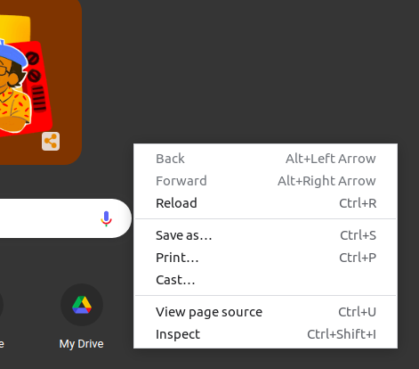
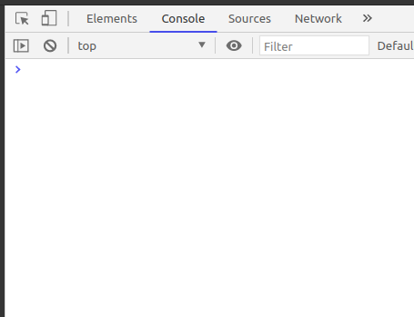

[**Back to Home**](./../README.md)

# Conditional and Primitive Data Types

## Instalasi Node.js

[Ikuti instruksi yang ada pada link ini](./preparation.md#nodejs)

## Apa itu JavaScript?

JavaScript ada di mana-mana. Kode program JavaScript dapat berjalan pada front-end (browser) maupun back-end (server).

### Bagaimana cara menjalankan JavaScript di browser?

1. Klik kanan pada Google Chrome, kemudian pilih `Inspect`.

   

1. Pilih tab `Console`.

   

### Bagaimana cara menjalankan JavaScript di terminal?

1. Lakukan instalasi Node.js.
1. Ketikkan perintah `node` pada terminal.

## Menampilkan Sesuatu pada Terminal

Bagaimana kita menampilkan kalimat 'Hello World!' pada terminal?

1. Buat sebuah file dengan nama `index.js`.
1. Ketikkan kode berikut pada `index.js`:

   ```javascript
   console.log("Hello World");
   ```

1. Ketikkan perintah `node index.js` pada terminal.

## Variable

Variable dapat diibaratkan sebagai sebuah wadah untuk menyimpan data. Salah satu cara kita membuat sebuah variable adalah menggunakan `var <namaVariable>`. Penamaan variable pada bahasa pemrograman JavaScript memiliki aturan sebagai berikut:

- Hanya dapat menggunakan huruf, angka, `_` dan `$`.
- Menggunakan `camelCase` seperti: `tokoBuku`, `angkaTerbesar`, `adaAngkaGanjil`, dst. (best practice)
- Tidak dapat menggunakan reserved keywords, yaitu kata yang sudah digunakan oleh JavaScript seperti: `let`, `var`, `const`, `class`, dll.
- Tidak dapat diawali dengan angka.
- Tidak dapat menggunakan space.

```javascript
var thisIsNumber; // Declaration
thisIsNumber = 10; // Assignment

var thisIsString = "Acong, Djoko, Sitorus"; // Declaration + assignment
var thisIsBoolean = true; // Declaration + assignment

thisIsNumber = 30; // Re-assignment

var thisIsNumber = 20; // Re-declaration (BAD PRACTICE!)
```

## Data Types

JavaScript merupakan bahasa pemrograman yang digunakan untuk membuat aplikasi. Aplikasi membutuhkan input data dan akan menghasilkan output sesuai dengan algoritma aplikasi dan data tersebut.

```
╭──────╮   ╭──────────╮   ╭────────╮
│ Data ├──>│ Aplikasi ├──>│ Output │
╰──────╯   ╰──────────╯   ╰────────╯
```

Semua data memiliki tipe. Pada JavaScript, tipe data dasar (_primitive_) ada 6 yaitu:

- String, tipa data yang berisi kumpulan karakter.
- Number, tipe data angka.
- Boolean, tipe data yang hanya berisi true/false.
- Undefined, value yang akan otomatis di-assign ke variable yang dideklarasikan
- [BigInt.](https://developer.mozilla.org/en-US/docs/Web/JavaScript/Reference/Global_Objects/BigInt)
- [Symbol.](https://developer.mozilla.org/en-US/docs/Web/JavaScript/Reference/Global_Objects/Symbol)

```javascript
var thisIsNumber = 10; // Number
var thisIsString = "Acong, Djoko, Sitorus"; // String
var thisIsBoolean = true; // Boolean

var thisIsUndefined1 = undefined; // Undefined
var thisIsUndefined2; // Undefined
```

## Mengecek Tipe Data Variable

Hanya dengan melihat kode program sebelumnya, kita dengan mudah dapat mengetahui tipe data masing-masing variable. Namun bagaimana komputer dapat mengetahui tipe data dari sebuah variable? Pada JavaScript, kita dapat menggunakan `typeof <namaVariable>`.

```javascript
var thisIsNumber = 10; // Number
var thisIsString = "Acong, Djoko, Sitorus"; // String
var thisIsBoolean = true; // Boolean

var thisIsUndefined1 = undefined; // Undefined
var thisIsUndefined2; // Undefined

console.log(typeof thisIsNumber); // number
console.log(typeof thisIsString); // string
console.log(typeof thisIsBoolean); // boolean
console.log(typeof thisIsUndefined1); // undefined
console.log(typeof thisIsUndefined2); // undefined

console.log(typeof typeof thisIsNumber); // ???
```

# Operator Aritmatika

Sama seperti bahasa pemrograman lainnya, pada JavaScript kita juga dapat melakukan operasi aritmatika.

```javascript
// Sesama Number
var input1 = 10;
var input2 = 3;

console.log(input1 + input2); // penjumlahan
console.log(input1 - input2); // pengurangan
console.log(input1 * input2); // perkalian
console.log(input1 / input2); // pembagian
console.log(input1 % input2); // modulus, sisa bagi
```

```javascript
// Sesama String
var input1 = "Hello";
var input2 = "World";

console.log(input1 + input2);
console.log(input1 - input2);
console.log(input1 * input2);
console.log(input1 / input2);
console.log(input1 % input2);
```

```javascript
// Number dan String
var input1 = "Hello";
var input2 = 5;

console.log(input1 + input2);
console.log(input1 - input2);
console.log(input1 * input2);
console.log(input1 / input2);
console.log(input1 % input2);

var input3 = "10";
var input4 = 5;

console.log(input3 + input4);
console.log(input3 - input4);
console.log(input3 * input4);
console.log(input3 / input4);
console.log(input3 % input4);
```

Best practice-nya, lakukan suatu operasi jika kedua variable memiliki tipe data yang sama. Silahkan bereksperimen lebih lanjut dengan `console.log()`.

## Konversi Tipe Data

Pada JavaScript, kita dapat melakukan konversi tipe data. Sebuah Number dapat diubah menjadi String, begitu pula sebaliknya.

```javascript
var input1 = 777;
var input2 = "999";

console.log(String(input1)); // '777'
console.log(Number(input2)); // 999

console.log(input1.toString()); // '777'
console.log(parseInt(input2)); // 999
```

Lebih lanjut mengenai konversi tipe data bisa menuju [link ini](https://flaviocopes.com/javascript-casting/).

## Operator Perbandingan

Pada JavaScript, kita dapat membandingkan suatu nilai variable dengan nilai variable lainnya. Kita dapat melakukan pembandingan dengan beberapa operator sebagai berikut:

| Operator  | Deskripsi                                                                           |
| --------- | ----------------------------------------------------------------------------------- |
| `x > y`   | x lebih dari y, nilai x di atas y, x lebih besar dari y                             |
| `x >= y`  | x lebih dari sama dengan y, nilai x adalah y ke atas, x lebih besar sama dengan y   |
| `x < y`   | x kurang dari y, nilai x di bawah y, x lebih kecil dari y                           |
| `x <= y`  | x kurang dari sama dengan y, nilai x adalah y ke bawah, x lebih kecil sama dengan y |
| `x == y`  | nilai x sama dengan nilai y                                                         |
| `x === y` | nilai x sama dengan nilai y dan tipe x sama dengan tipe y                           |
| `x != y`  | nilai x sama dengan nilai y                                                         |
| `x !== y` | nilai x tidak sama dengan nilai y dan tipe x tidak sama dengan tipe y               |

```javascript
var input1 = 10;
var input2 = 20;
console.log(input1 > input2); // false
console.log(input1 < input2); // true
```

## Operator Logic

### AND `&&`

Hanya akan `true` jika kedua kondisi yang di di-AND-kan bernilai true.

```javascript
console.log(true && true); // true
console.log(true && false); // false
console.log(false && true); // false
console.log(false && false); // false

// Contoh: Mengecek apakah sebuah nilai ada di dalam range
// 10 < input < 20
var input = 15;
console.log(10 < input && input < 20);
```

### OR `||`

Hanya akan `false` jika kedua kondisi yang di-OR-kan bernilai false.

```javascript
console.log(true || true); // true
console.log(true || false); // true
console.log(false || true); // true
console.log(false || false); // false

// Contoh: Mengecek apakah sebuah nilai ada di luar range
// Jika input kurang dari 3 atau lebih dari 5, tampilkan false pada terminal
console.log(input < 3 || input > 5);
```

## Kondisional

Kondisional digunakan untuk menjalankan suatu bagian kode program apabila suatu kondisi telah terpenuhi (`true`). Pada JavaScript, kita dapat membuat statement kondisional menggunakan keyword `if-else`.

```javascript
if (kondisi1) {
  // kode program
} else if (kondisi2) {
  // kode program
} else {
  // kode program
}
```

```javascript
/**
 * Buatlah sebuah program yang akan menampilkan:
 *   - 'input adalah boolean' jika tipe data dari input adalah boolean
 *   - 'input adalah number' jika tipe data dari input adalah number
 *   - 'input adalah string' jika tipe data dari input adalah string
 */

var input = 10; // Nilai dari input boleh diganti-ganti

// Your code here
```

## Truthy dan Falsy

Pada JavaScript, setiap variable memiliki nilai boolean "built-in" yang disebut juga sebagai truthy falsy. Cara kita mengakses nilai built-in boolean tersebut adalah dengan melakukan konversi tipe data ke Boolean. Kita dapat menggunakan `Boolean(<namaVariable>)`.

```javascript
var input = 0; // Nilai dari input boleh diganti-ganti

console.log(Boolean(input));
```

Dari hasil percobaan singkat di atas, dapat diambil kesimpulan bahwa nilai di bawah adalah falsy:

- `0`
- `''`
- `null`
- `undefined`
- `NaN`

```javascript
/**
 * Buatlah sebuah program yang akan menampilkan:
 *   - 'Nama tidak boleh kosong' jika input kosong.
 *   - 'Namamu adalah <input>, silahkan masuk' jika nama tidak kosong.
 */

var input = 'Acong'; // Nilai dari input boleh diganti-ganti

// Your code here
```

[**Back to Home**](./../README.md)
